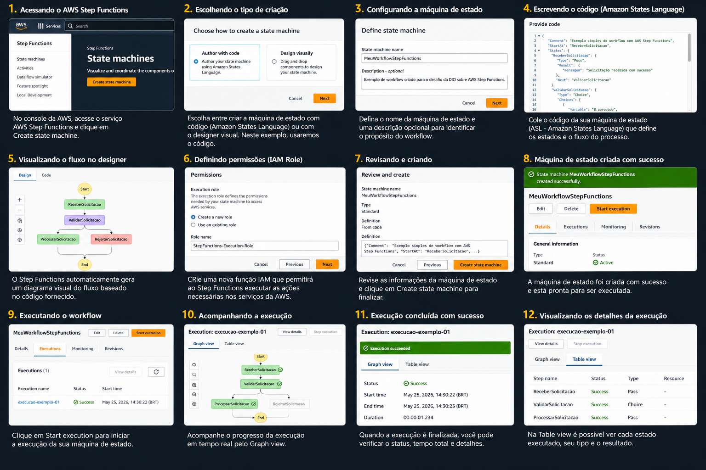

# Consolidando Workflows Automatizados com AWS Step Functions

## Sobre o desafio

Este repositório foi criado como entrega do desafio da DIO sobre **AWS Step Functions**.

O objetivo deste laboratório é consolidar os conhecimentos adquiridos durante as aulas, documentando conceitos, anotações e insights sobre a criação de workflows automatizados utilizando o AWS Step Functions.


## Imagem do fluxo na AWS Step Functions

A imagem abaixo representa uma simulação visual das etapas realizadas no AWS Step Functions durante a criação, configuração e execução de uma máquina de estado.



## Objetivos de aprendizagem

Durante este desafio, foram trabalhados os seguintes pontos:

* Aplicação dos conceitos aprendidos em um ambiente prático;
* Documentação de processos técnicos de forma clara e organizada;
* Utilização do GitHub como ferramenta para compartilhamento de documentação técnica;
* Compreensão da estrutura de workflows automatizados;
* Registro de aprendizados para consultas futuras.

## O que é AWS Step Functions?

O **AWS Step Functions** é um serviço da AWS utilizado para criar e gerenciar workflows automatizados.

Com ele, é possível organizar processos em etapas, chamadas de **estados**, permitindo controlar o fluxo de execução de uma aplicação ou automação.

Esses workflows também são conhecidos como **máquinas de estado**.

## Conceitos principais

| Conceito               | Descrição                                               |
| ---------------------- | ------------------------------------------------------- |
| State Machine          | Representa o workflow completo.                         |
| State                  | Cada etapa dentro do fluxo.                             |
| Task                   | Estado responsável por executar uma ação.               |
| Choice                 | Estado usado para tomada de decisão.                    |
| Pass                   | Estado que apenas repassa dados.                        |
| Wait                   | Estado que pausa o fluxo por um período.                |
| Succeed                | Estado que finaliza o fluxo com sucesso.                |
| Fail                   | Estado que finaliza o fluxo com erro.                   |
| Amazon States Language | Linguagem baseada em JSON usada para definir workflows. |

## Exemplo de fluxo

Um workflow simples pode seguir a seguinte lógica:

1. Receber uma solicitação;
2. Validar os dados recebidos;
3. Verificar se a solicitação foi aprovada;
4. Processar a solicitação;
5. Finalizar com sucesso ou erro.

Esse tipo de estrutura ajuda a organizar processos que possuem várias etapas e decisões.

## Exemplo de State Machine

```json
{
  "Comment": "Exemplo simples de workflow com AWS Step Functions",
  "StartAt": "ReceberSolicitacao",
  "States": {
    "ReceberSolicitacao": {
      "Type": "Pass",
      "Result": {
        "mensagem": "Solicitação recebida com sucesso"
      },
      "Next": "ValidarSolicitacao"
    },
    "ValidarSolicitacao": {
      "Type": "Choice",
      "Choices": [
        {
          "Variable": "$.aprovado",
          "BooleanEquals": true,
          "Next": "ProcessarSolicitacao"
        }
      ],
      "Default": "RejeitarSolicitacao"
    },
    "ProcessarSolicitacao": {
      "Type": "Pass",
      "Result": {
        "status": "Processado"
      },
      "End": true
    },
    "RejeitarSolicitacao": {
      "Type": "Fail",
      "Error": "SolicitacaoRejeitada",
      "Cause": "A solicitação não foi aprovada."
    }
  }
}
```

## Etapas realizadas

* Assisti às vídeo-aulas do desafio;
* Revisei os conceitos sobre AWS Step Functions;
* Estudei a estrutura de uma máquina de estado;
* Analisei como os estados são conectados dentro de um workflow;
* Criei este repositório para documentar o aprendizado;
* Organizei as anotações em formato Markdown.

## Principais aprendizados

Durante o laboratório, compreendi que o AWS Step Functions facilita a criação de automações porque permite visualizar e controlar cada etapa de um processo.

Também entendi que a organização por estados torna o fluxo mais claro, principalmente em processos que envolvem decisões, validações e integrações com outros serviços.

Outro aprendizado importante foi a importância de documentar o processo técnico, pois isso facilita revisões futuras e demonstra melhor o conhecimento adquirido.

## Possíveis aplicações

O AWS Step Functions pode ser usado em diversos cenários, como:

* Processamento de pedidos;
* Automação de tarefas;
* Fluxos de aprovação;
* Integração entre serviços AWS;
* Pipelines de dados;
* Orquestração de funções Lambda;
* Processos com múltiplas etapas de validação.

## Conclusão

Este desafio foi importante para consolidar os conhecimentos sobre workflows automatizados com AWS Step Functions.

Além de reforçar os conceitos técnicos, a prática também ajudou a desenvolver a habilidade de documentar projetos de forma clara e organizada utilizando o GitHub.

## Referências

* AWS Step Functions Documentation
* Amazon States Language
* GitHub Markdown Guide
* Plataforma DIO

## Autor

Antonio Jonas
